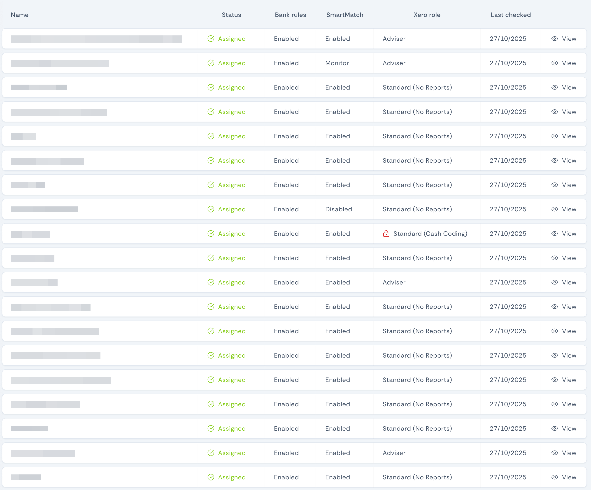

import {Aside} from '@astrojs/starlight/components';
import GuideJar from '../../../components/GuideJar.astro'

Otto is like another employee (except he doesn't need a computer, a branded notepad, or annual leave) so accesses Xero using a web browser. His access is determined by you by inviting him to Xero HQ and assigning clients to him. You can add or remove clients at any time.

## Inviting Otto to your practice
<GuideJar id="9d396a45-46c6-44a7-b93e-c4a0e2ae6d62"></GuideJar>

## Assigning clients
<GuideJar id="ECnEMKiMsQW8ob30kF4I"></GuideJar>

## Checking Otto has the correct access
Like Goldilocks and her porridge, it is important that Otto has neither too much or too little access to your clients. You can check he has just the right role by viewing the [clients list](https://portal.withotto.app/clients/) in the portal. Any of your clients where Otto doesn't have the correct access will display a red padlock symbol.

View the client details page to confirm the role you should give him in Xero HQ.

<Aside>
    See [assigning clients](#assigning-clients) for steps to assign Otto the correct Xero role.
</Aside>

<Aside type="tip" title="Related pages">
    - [Making the most of your trial](../making-the-most-of-your-trial) - tips to get the most out of your free trial
</Aside>
