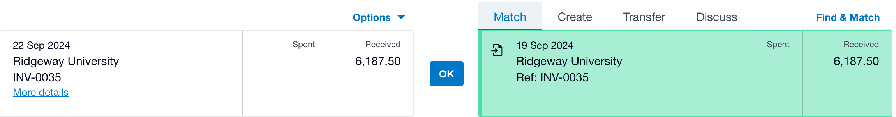
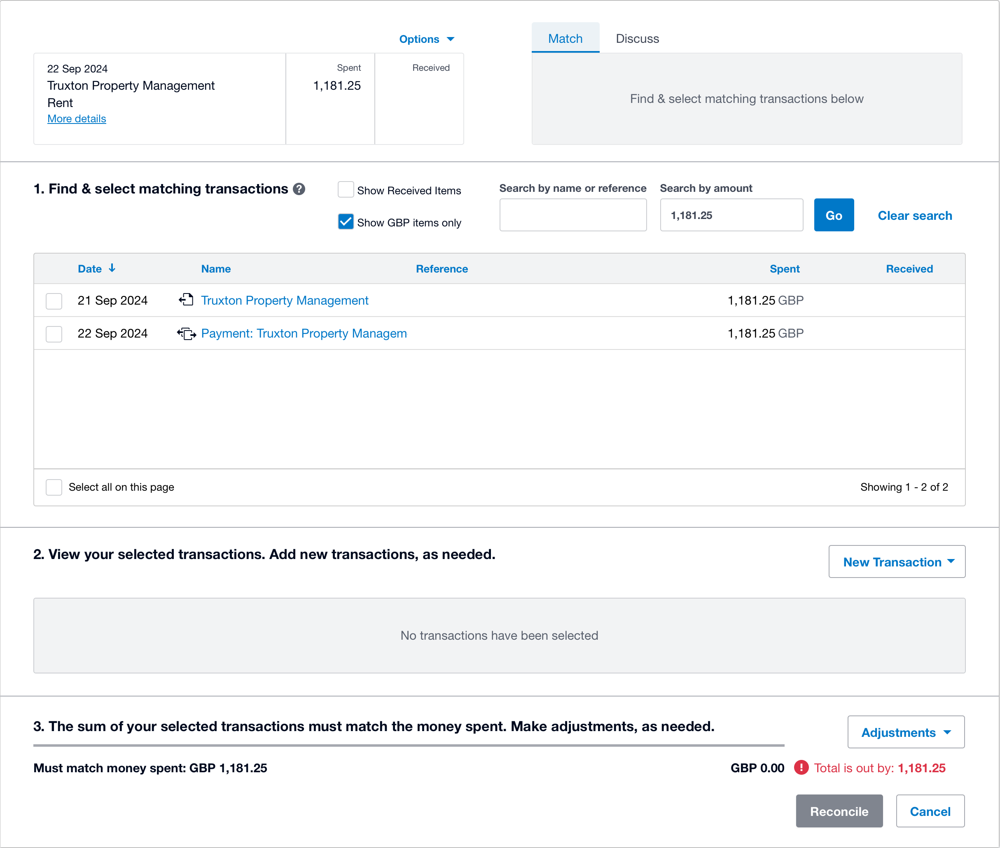

## Bank rules
Otto will reconcile any bank rules you have set up as soon as he starts working in your practice. He isn't able to fill in any details, such as the payee or any references, so will skip any he finds. 

There is no way for Otto to make sure that the rule has been set up correctly so please make sure any rules you create only match the transactions you want him to reconcile.

## Transactions with a bill or invoice
Otto supports these types of possible matches in Xero

### A single possible match

Otto compares the details from the bank statement and the Xero match to decide if they relate to the same transaction.

### Multiple possible matches

Otto compares the details from the bank statement to each of the possible matches and decides which could relate to the bank transaction. If there is more than one match that looks like it could be correct, he chooses the one which is the best match.

## Related
- [How Otto decides what to reconcile](/guides/how-does-otto-decide-what-to-reconcile)
